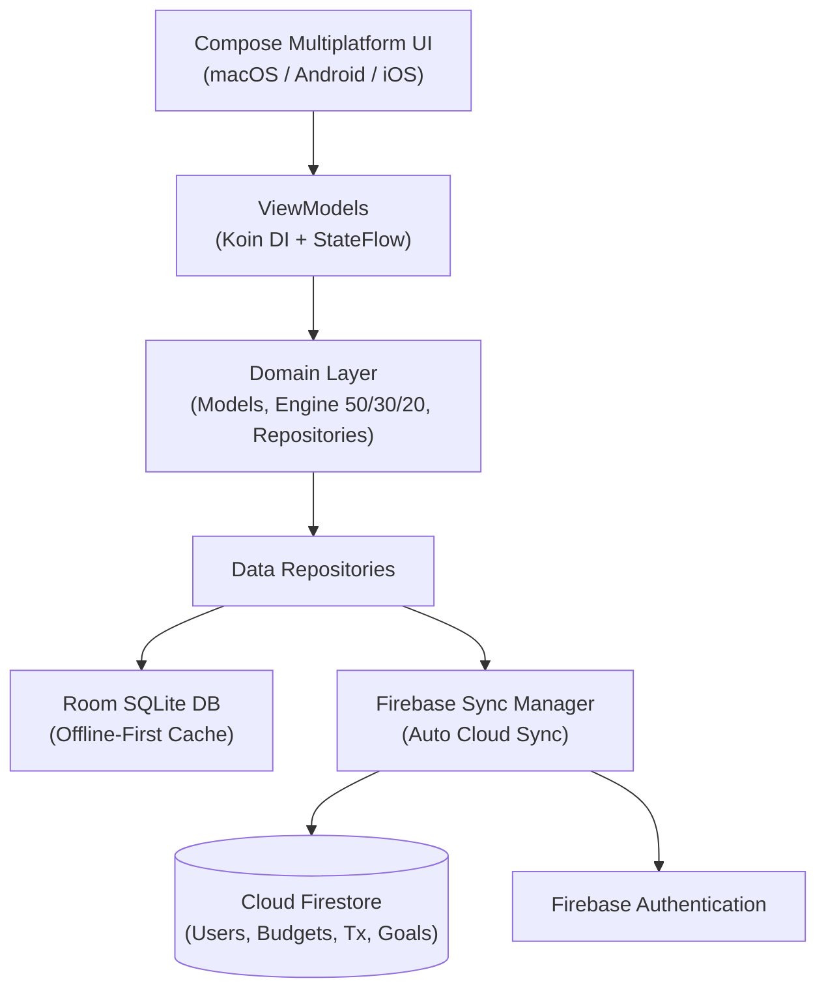

<div align="center">

  

  # Finanzas Claras

  **Tu salud financiera bajo control, en todos tus dispositivos.**  
  *Aplicación moderna de finanzas personales multiplataforma con sincronización automática en la nube.*

  <p align="center">
    <a href="#-características-principales">Características</a> •
    <a href="#-plan-de-presupuesto-inteligente-503020">Presupuestos</a> •
    <a href="#-análisis-financiero-avanzado">Análisis</a> •
    <a href="#-sincronización-en-tiempo-real">Sincronización</a> •
    <a href="#-tecnologías-y-arquitectura">Tecnologías</a> •
    <a href="#-instalación-y-ejecución">Instalación</a>
  </p>

  <p align="center">
    
    
    
    
    
  </p>

</div>

---

## 📱 ¿Qué es Finanzas Claras?

**Finanzas Claras** es una solución integral y moderna diseñada para el control y la gestión inteligente de tus finanzas personales. Construida con **Kotlin Multiplatform (KMP)** y **Compose Multiplatform**, permite registrar ingresos, gastos, metas de ahorro, inversiones y presupuestos con una interfaz moderna de estilo *fintech*.

Cuenta con **sincronización bidireccional automática en la nube** mediante Cloud Firestore: cualquier presupuesto, transacción o cambio que realices en tu Mac se refleja automáticamente en tu teléfono Android y viceversa, manteniendo siempre tus datos respaldados y disponibles sin conexión a internet (**Offline-First**).

---

## ✨ Características Principales

### 💳 Registro Inteligente de Transacciones
- Selector ágil de tipo de movimiento (*Gasto* o *Ingreso*) con badges distintivos.
- **Hero Amount Card** con tipografía de alto contraste y selector de divisa (DOP, USD, EUR, etc.).
- Chips de incremento rápido (`+100`, `+500`, `+1,000`, `+5,000`) para agilizar el registro diario.
- Cuadrícula fluida adaptativa (`FlowRow`) con categorías completas y auto-selección inicial.

### 📊 Dashboard Financiero Adaptable
- Vista responsiva: distribución en **dos columnas en escritorio (macOS)** y **una columna optimizada en móviles**.
- Saludo personalizado inteligente con tu nombre (`Hola, Jose Gabriel Estrella`).
- Accesos directos optimizados (`Historial`, `Plan`, `Análisis`, `Ahorros`, `Invertir`) calibrados para evitar desbordes en cualquier tamaño de pantalla.
- Resumen de balance general, desglose de ingresos y gastos del mes actual.
- Movimientos recientes con iconos y colores temáticos por categoría.

---

## 🎯 Plan de Presupuesto Inteligente (Regla 50/30/20)

Finanzas Claras incluye un **Motor de Recomendación Financiera** basado en la regla **50/30/20**, diseñado para ayudarte a organizar tu dinero en base a tus ingresos reales:

- 🟢 **50% Necesidades**: Vivienda, supermercado, servicios, salud y transporte.
- 🔵 **30% Deseos y Estilo de Vida**: Comidas fuera, entretenimiento, compras y suscripciones.
- 🟡 **20% Ahorro e Inversión**: Fondo de emergencia, ahorro y crecimiento patrimonial.

### ¿Cómo funciona?
1. **Configuración de Sueldo**: Ingresa tu salario mensual o deja que la app lo calcule automáticamente en base a tus ingresos registrados.
2. **Generación Automática**: Con un solo toque en *"Aplicar Plan Recomendado"*, la app distribuye tus límites por categoría respetando exactamente tu capacidad económica (sin presupuestar más dinero del que ganas).
3. **Monitoreo en Tiempo Real**: Barras de progreso visuales que cambian de color (verde 🟢, amarillo 🟡, rojo 🔴) para alertarte si estás cerca de exceder tu límite o si te has sobrepasado.
4. **Edición Flexible**: Agrega categorías personalizadas, modifica montos o elimina presupuestos en cualquier momento.

---

## 📈 Análisis Financiero Avanzado

La pantalla de **Análisis** transforma tus números en decisiones inteligentes:

- 🔄 **Comparativa Mes Actual vs. Mes Anterior**: Descubre si tus gastos subieron o bajaron con respecto al mes anterior, con cálculo exacto de variación porcentual y diferencia monetaria.
- 🏆 **Ranking de Categorías**: Visualiza en qué gastas más dinero con desglose de porcentaje sobre el total y ordenamiento dinámico.
- 📅 **Promedio Diario y Proyección**: Conoce tu gasto promedio por día y cuánto proyectas gastar al cierre de mes al ritmo actual.
- 💡 **Consejos Financieros Dinámicos**: Recomendaciones automáticas generadas en base a tus categorías de mayor consumo (supermercado, comida fuera, tarjetas de crédito, etc.).

---

## 🔄 Sincronización en Tiempo Real (Cloud Sync)

La sincronización entre dispositivos es **100% automática y transparente**:

- ⚡ **Bidireccional Instantánea**: Si creas o modificas un presupuesto en macOS, se actualiza inmediatamente en tu celular Android, y viceversa.
- ☁️ **Sincronización del Perfil y Sueldo**: Tu ingreso mensual configurado (`monthlyIncome`) se respalda en tu perfil de Firestore, asegurando que ambos dispositivos compartan el mismo plan.
- 🗑️ **Eliminación Remota Segura**: Si eliminas un presupuesto o transacción en un dispositivo, se borra de la nube y desaparece de todos tus dispositivos sin reaparecer.
- 🔄 **Refresco Periódico en Segundo Plano**: Sincronización automática periódica cada 15 segundos y al abrir cualquier pantalla de la app.
- 📴 **Offline-First**: Si no tienes conexión, todos los cambios se guardan localmente en tu base de datos SQLite y se sincronizan al recuperar internet.

---

## 🏷️ Categorías Especializadas para tu Día a Día

| Tipo | Categorías Disponibles |
| :--- | :--- |
| **Gastos** | Pago de Tarjeta de Crédito, Pago de Préstamo / Cuotas, Supermercado, Servicios Básicos, Comida y Restaurantes, Transporte / Combustible, Vivienda / Alquiler, Salud y Farmacia, Suscripciones, Entretenimiento, Ropa y Calzado, Educación, Otros Gastos |
| **Ingresos** | Salario / Nómina, Préstamos Recibidos, Rendimientos de Inversión, Freelance / Negocio, Bonos e Incentivos, Otros Ingresos |

---

## 🛠 Tecnologías y Arquitectura

Diseñado bajo los principios de **Clean Architecture** y patrón **MVI / MVVM**, separando responsabilidades en capas desacopladas:

| Capa | Tecnologías Utilizadas |
| :--- | :--- |
| **Framework Base** | [Kotlin Multiplatform (KMP)](https://kotlinlang.org/docs/multiplatform.html) + [Compose Multiplatform](https://www.jetbrains.com/lp/compose-multiplatform/) |
| **Diseño / UI** | Material Design 3, Icons Extended, Animaciones fluidas y Tipografía adaptativa |
| **Base de Datos Local** | **Room KMP** + **SQLite Bundled Driver** (almacenamiento nativo multiplataforma) |
| **Cloud & Backend** | **Firebase Auth** (Autenticación) + **Cloud Firestore** (Base de datos en tiempo real) |
| **Inyección de Dependencias** | [Koin Multiplatform](https://insert-koin.io/) (Koin Core + Compose ViewModel) |
| **Almacenamiento Clave-Valor** | Multiplatform Settings (preferencias, sueldo y modo oscuro) |
| **Concurrencia & Flujos** | Kotlin Coroutines + Kotlinx Flows + Kotlinx Serialization + Kotlinx DateTime |



---

## 💻 Plataformas Soportadas

| Plataforma | Estado | Formato de Distribución |
| :---: | :---: | :---: |
| **macOS** | ✅ Disponible y Optimizado | Bundle nativo `.app` e Instalador `.dmg` |
| **Android** | ✅ Disponible y Optimizado | Paquete `.apk` compatible con Android 8.0+ |
| **iOS** | 🔄 Estructura KMP Lista | Framework ComposeApp para Xcode |
| **Windows / Linux** | 🔄 Compatible vía Desktop JVM | Distribuible JAR / Nativo |

---

## 🚀 Instalación y Ejecución

### Requisitos Previos:
- **JDK 17** o **JDK 21** (Eclipse Temurin / OpenJDK recomendado)
- **Android Studio** (Koala / Ladybug) o **IntelliJ IDEA**
- Para macOS: macOS 12.0+
- Para Android: Android 8.0 (API 26)+

### Clonar el Repositorio:
```bash
git clone https://github.com/joseestrella05/finanzasclaras.git
cd finanzasclaras
```

### Ejecutar en macOS:
```bash
./gradlew composeApp:run
```

O generar el instalador distribuible:
```bash
./gradlew composeApp:createDistributable
# La app se compila en:
open composeApp/build/compose/binaries/main/app/FinanzasClaras.app
```

Para crear el archivo de instalación `.dmg`:
```bash
./gradlew composeApp:packageDmg
# El instalador se genera en:
open composeApp/build/compose/binaries/main/dmg/
```

### Generar APK para Android:
```bash
./gradlew composeApp:assembleDebug
# El APK listo para instalar se ubica en:
open composeApp/build/outputs/apk/debug/composeApp-debug.apk
```

---

## ⚙️ Configuración de Firebase

1. Crea un proyecto en [Firebase Console](https://console.firebase.google.com/).
2. **Authentication**:
   - Activa el proveedor **Correo electrónico/contraseña** en *Authentication > Sign-in method*.
3. **Cloud Firestore**:
   - Crea tu base de datos en modo producción.
   - En la pestaña **Reglas (Rules)**, aplica la siguiente configuración de seguridad:
   ```javascript
   rules_version = '2';
   service cloud.firestore {
     match /databases/{database}/documents {
       match /users/{userId}/{document=**} {
         allow read, write: if request.auth != null && request.auth.uid == userId;
       }
     }
   }
   ```
4. Agrega los archivos de configuración:
   - Android: `composeApp/google-services.json`
   - Configuración nativa para iOS y Desktop según corresponda.

---

## 📂 Estructura del Código

```text
finanzasclaras/
├── composeApp/                     # Módulo Multiplataforma principal
│   ├── src/
│   │   ├── commonMain/            # Lógica, Dominio y UI 100% compartidas
│   │   │   ├── kotlin/com/finanzasclaras/app/
│   │   │   │   ├── core/          # Tema, utilidades, DI (Koin), UserPreferences
│   │   │   │   ├── data/          # Room DB, DAOs, Entidades, FirebaseSyncManager
│   │   │   │   ├── domain/        # Modelos, BudgetRecommendationEngine, Interfaces
│   │   │   │   └── presentation/  # Pantallas Compose (Dashboard, Budgets, Analysis, Auth)
│   │   ├── androidMain/           # Implementación Android (Activity, Manifest, Resources)
│   │   ├── desktopMain/           # Implementación Desktop macOS (Main JVM, App Bundle)
│   │   └── iosMain/               # Punto de entrada para ViewController en iOS
│   └── build.gradle.kts           # Dependencias y configuración multiplataforma
├── build.gradle.kts                # Configuración global del proyecto
└── settings.gradle.kts             # Módulos del proyecto
```

---

## 👤 Autor

Desarrollado con dedicación por **Jose Gabriel Estrella**.

<p align="left">
  <a href="https://github.com/joseestrella05">
    
  </a>
</p>
