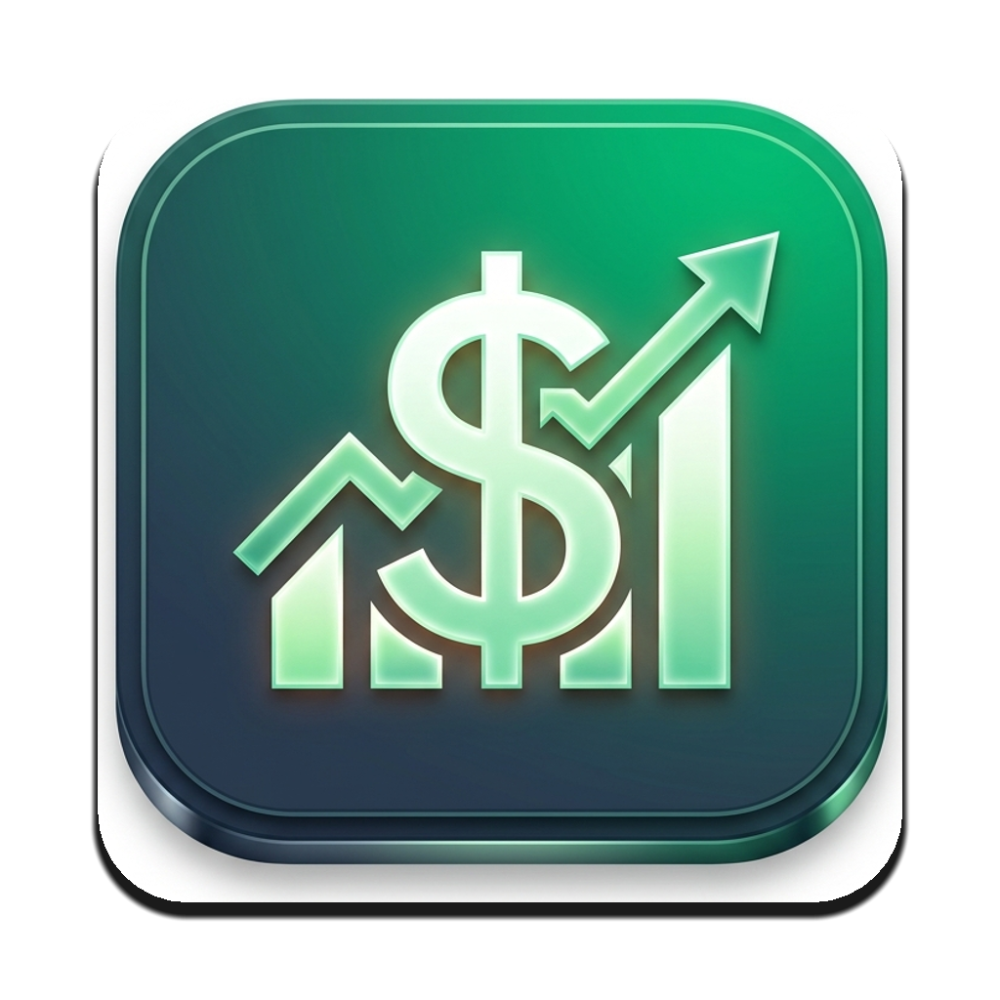
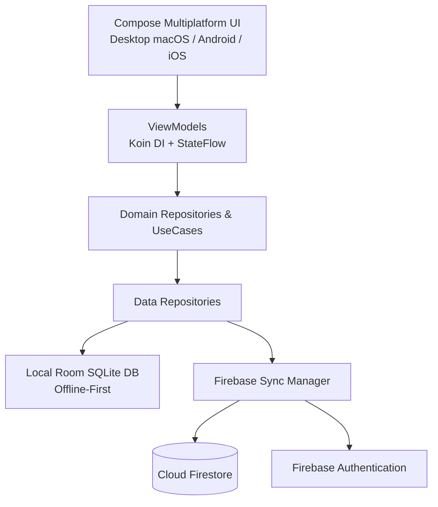

<div align="center">

  

  # Finanzas Claras

  **Tu salud financiera bajo control, en todos tus dispositivos.**  
  *Aplicación moderna de finanzas personales multiplataforma con sincronización en tiempo real.*

  <p align="center">
    <a href="#-características-principales">Características</a> •
    <a href="#-tecnologías-y-arquitectura">Tecnologías</a> •
    <a href="#-plataformas-soportadas">Plataformas</a> •
    <a href="#-instalación-y-ejecución">Instalación</a> •
    <a href="#-configuración-de-firebase">Firebase</a>
  </p>

  <p align="center">
    
    
    
    
  </p>

</div>

---

## 📱 ¿Qué es Finanzas Claras?

**Finanzas Claras** es una solución integral y moderna diseñada para el control y gestión inteligente de tus finanzas personales. Construida con **Kotlin Multiplatform (KMP)** y **Compose Multiplatform**, permite registrar ingresos, gastos, presupuestos y metas de ahorro con una interfaz intuitiva de estilo *fintech* y sincronización bidireccional automática en la nube.

Lo que registras en tu celular Android se actualiza automáticamente en tu Mac o viceversa, manteniendo siempre tus datos respaldados y accesibles incluso sin conexión a internet (**Offline-First**).

---

## ✨ Características Principales

- 💳 **Registro Inteligente de Transacciones**:
  - Selector ágil de tipo de movimiento (*Gasto* o *Ingreso*) con badges distintivos.
  - *Hero Amount Card* con tipografía de alto contraste y selector de divisa (DOP, USD, EUR, etc.).
  - Chips de incremento rápido (`+100`, `+500`, `+1,000`, `+5,000`) para agilizar el registro diario.
  - Cuadrícula fluida adaptativa (`FlowRow`) con categorías completas y auto-selección inicial.

- 📊 **Dashboard Financiero Adaptable**:
  - Vista responsiva: distribución en **dos columnas en escritorio (macOS)** y **una columna optimizada en móviles**.
  - Tarjeta de balance general, desglose de ingresos y gastos del mes actual.
  - Historial de movimientos recientes con avatares e iconos correspondientes a cada categoría.
  - Botón de sincronización manual (`⟳`) para forzar la actualización instantánea con la nube.

- 🏷️ **Categorías Especializadas para tu Día a Día**:
  - *Gastos*: Pago de Tarjeta de Crédito, Pago de Préstamo / Cuotas, Supermercado, Servicios, Comida, Transporte, Vivienda, Salud, Suscripciones y más.
  - *Ingresos*: Salario, Préstamos Recibidos, Rendimientos de Inversión, Freelance y Bonos.

- 🔄 **Sincronización en Tiempo Real (Cloud Sync)**:
  - Respaldado con **Cloud Firestore**.
  - Arquitectura **Offline-First**: las transacciones se guardan localmente de inmediato y se sincronizan en segundo plano en cuanto hay conexión.

- 🎯 **Metas de Ahorro e Inversiones**:
  - Planificación de objetivos con seguimiento de aportes progresivos y cálculo de montos restantes.
  - Registro de portafolios y rendimientos de inversión.

- 🌓 **Diseño Adaptable y Accesible**:
  - Soporte completo para **Modo Oscuro** y **Modo Claro**.
  - Contraste visual optimizado y superficies estilizadas tipo card.
  - Posibilidad de uso con cuenta o en **Modo Local** (*Continuar sin cuenta*).

---

## 🛠 Tecnologías y Arquitectura

El proyecto está diseñado bajo los principios de **Clean Architecture** y patrón **MVI / MVVM**, separando responsabilidades en capas desacopladas:

| Capa | Tecnologías Utilizadas |
| :--- | :--- |
| **Framework Base** | [Kotlin Multiplatform (KMP)](https://kotlinlang.org/docs/multiplatform.html) + [Compose Multiplatform](https://www.jetbrains.com/lp/compose-multiplatform/) |
| **Diseño / UI** | Material Design 3, Icons Extended, Tipografía adaptativa y componentes reactivos |
| **Base de Datos Local** | **Room KMP** + **SQLite Bundled Driver** (almacenamiento nativo multiplataforma) |
| **Sincronización & Cloud** | **Firebase Auth** (Login/Registro con fallback REST) + **Cloud Firestore** |
| **Inyección de Dependencias** | [Koin Multiplatform](https://insert-koin.io/) (Koin Core + Compose ViewModel) |
| **Almacenamiento Clave-Valor** | Multiplatform Settings (preferencias y configuración del usuario) |
| **Concurrencia & Flujos** | Kotlin Coroutines + Kotlinx Flows + Kotlinx Serialization |



---

## 💻 Plataformas Soportadas

| Plataforma | Estado | Formato de Distribución |
| :---: | :---: | :---: |
| **macOS** | ✅ Disponible y Optimizado | Bundle nativo `.app` e Instalador `.dmg` |
| **Android** | ✅ Disponible y Optimizado | Paquete `.apk` compatible con Android 8.0+ |
| **iOS** | 🔄 Estructura KMP Lista | ComposeApp Framework para Xcode |
| **Windows / Linux** | 🔄 Compatible vía Desktop JVM | Distribuible JAR / Nativo |

---

## 🚀 Instalación y Ejecución

### Requisitos Previos:
- **JDK 17** o **JDK 21** (Eclipse Temurin / OpenJDK recomendado)
- **Android Studio** (Koala / Ladybug) o **IntelliJ IDEA**
- Para macOS: macOS 12.0+
- Para Android: Android 8.0 (API 26)+

### Clonar el Repositorio:
```bash
git clone https://github.com/joseestrella05/finanzasclaras.git
cd finanzasclaras
```

### Ejecutar en macOS Desktop:
```bash
./gradlew composeApp:run
```
O empaquetar el instalador `.dmg` e instalarlo en tu carpeta de Aplicaciones:
```bash
./gradlew composeApp:packageDmg
# El instalador se genera en:
open composeApp/build/compose/binaries/main/dmg/FinanzasClaras-1.0.0.dmg
```

### Generar APK para Android:
```bash
./gradlew composeApp:assembleDebug
# El archivo APK listo para instalar se genera en:
open composeApp/build/outputs/apk/debug/composeApp-debug.apk
```

---

## ⚙️ Configuración de Firebase

1. Crea un proyecto en [Firebase Console](https://console.firebase.google.com/).
2. **Authentication**:
   - Activa el proveedor **Correo electrónico/contraseña** en *Authentication > Sign-in method*.
3. **Cloud Firestore**:
   - Crea tu base de datos (por ejemplo, en ubicación `nam5 (us-central)`).
   - En la pestaña **Reglas (Rules)**, aplica la siguiente configuración para proteger los datos por usuario:
   ```javascript
   rules_version = '2';
   service cloud.firestore {
     match /databases/{database}/documents {
       match /users/{userId}/{document=**} {
         allow read, write: if request.auth != null && request.auth.uid == userId;
       }
     }
   }
   ```
4. Coloca tu archivo `google-services.json` en `composeApp/google-services.json`.

---

## 📂 Estructura del Código

```text
finanzasclaras/
├── composeApp/                     # Módulo Multiplataforma principal
│   ├── src/
│   │   ├── commonMain/            # Lógica y UI 100% compartida
│   │   │   ├── kotlin/com/finanzasclaras/app/
│   │   │   │   ├── core/          # Tema, utilidades, DI (Koin), settings
│   │   │   │   ├── data/          # Room DB, DAOs, Entidades, Repositorios, Firebase
│   │   │   │   ├── domain/        # Modelos de negocio e interfaces
│   │   │   │   └── presentation/  # Pantallas Compose y ViewModels (Dashboard, Auth, etc.)
│   │   ├── androidMain/           # Implementación específica de Android (Activity, Manifest, Mipmaps)
│   │   ├── desktopMain/           # Implementación específica de Desktop (Main Swing, Iconos ICNS)
│   │   └── iosMain/               # Punto de entrada para ViewController en iOS
│   └── build.gradle.kts           # Dependencias y configuración multiplataforma
├── build.gradle.kts                # Configuración global de Gradle y plugins
└── settings.gradle.kts             # Módulos del proyecto
```

---

## 👤 Autor

Desarrollado con dedicación por **Jose Gabriel Estrella**.

<p align="left">
  <a href="https://github.com/joseestrella05">
    
  </a>
</p>
